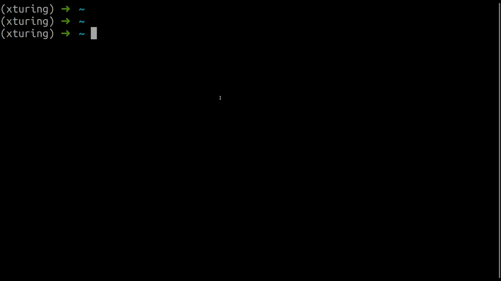
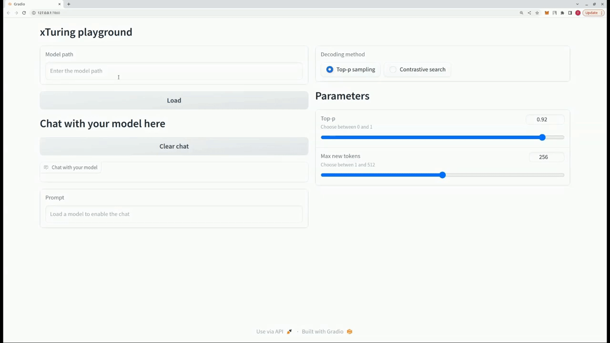

<p align="center">
  
  
</p>
<h3 align="center">Fine‑tune, evaluate, and run private, personalized LLMs</h3>

<p align="center">
  <a href="https://pypi.org/project/xturing/">
    
  </a>
  <a href="https://xturing.stochastic.ai/">
    
  </a>
  <a href="https://discord.gg/TgHXuSJEk6">
    
  </a>
</p>

<br>

___

`xTuring` makes it simple, fast, and cost‑efficient to fine‑tune open‑source LLMs (e.g., GPT‑OSS, LLaMA/LLaMA 2, Falcon, GPT‑J, GPT‑2, OPT, Bloom, Cerebras, Galactica) on your own data — locally or in your private cloud.

Why xTuring:
- Simple API for data prep, training, and inference
- Private by default: run locally or in your VPC
- Efficient: LoRA and low‑precision (INT8/INT4) to cut costs
- Scales from CPU/laptop to multi‑GPU easily
- Evaluate models with built‑in metrics (e.g., perplexity)

<br>

## ⚙️ Installation
```bash
pip install xturing
```

<br>

## 🚀 Quickstart

Run a small, CPU‑friendly example first:

```python
from xturing.datasets import InstructionDataset
from xturing.models import BaseModel

# Load a toy instruction dataset (Alpaca format)
dataset = InstructionDataset("./examples/models/llama/alpaca_data")

# Start small for quick iterations (works on CPU)
model = BaseModel.create("distilgpt2_lora")

# Fine‑tune and then generate
model.finetune(dataset=dataset)
output = model.generate(texts=["Explain quantum computing for beginners."])
print(f"Model output: {output}")
```

Want bigger models and reasoning controls? Try GPT‑OSS variants (requires significant resources):

```python
from xturing.models import BaseModel

# 120B or 20B variants; also support LoRA/INT8/INT4 configs
model = BaseModel.create("gpt_oss_20b_lora")
```

You can find the data folder [here](examples/models/llama/alpaca_data).

<br>

## 🌟 What's new?
Highlights from recent updates:
1. __GPT‑OSS integration__ – Use and fine‑tune `gpt_oss_120b` and `gpt_oss_20b` with off‑the‑shelf, INT8, LoRA, LoRA+INT8, and LoRA+INT4 options. Includes configurable reasoning levels and harmony response format support.
```python
from xturing.models import BaseModel

# Use the production-ready 120B model
model = BaseModel.create('gpt_oss_120b_lora')

# Or use the efficient 20B model for faster inference
model = BaseModel.create('gpt_oss_20b_lora')

# Both models support reasoning levels via system prompts
```
2. __LLaMA 2 integration__ – Off‑the‑shelf, INT8, LoRA, LoRA+INT8, and LoRA+INT4 via `GenericModel` or `Llama2`.
```python
from xturing.models import Llama2
model = Llama2()

## or
from xturing.models import BaseModel
model = BaseModel.create('llama2')

```
3. __Evaluation__ – Evaluate any causal LM on any dataset. Currently supports [`perplexity`](https://en.wikipedia.org/wiki/Perplexity).
```python
# Make the necessary imports
from xturing.datasets import InstructionDataset
from xturing.models import BaseModel

# Load the desired dataset
dataset = InstructionDataset('../llama/alpaca_data')

# Load the desired model (try GPT-OSS for advanced reasoning)
model = BaseModel.create('gpt_oss_20b')

# Run the Evaluation of the model on the dataset
result = model.evaluate(dataset)

# Print the result
print(f"Perplexity of the evalution: {result}")

```
4. __INT4 precision__ – Fine‑tune many LLMs with INT4 using `GenericLoraKbitModel`.
```python
# Make the necessary imports
from xturing.datasets import InstructionDataset
from xturing.models import GenericLoraKbitModel

# Load the desired dataset
dataset = InstructionDataset('../llama/alpaca_data')

# Load the desired model for INT4 bit fine-tuning
model = GenericLoraKbitModel('tiiuae/falcon-7b')

# Run the fine-tuning
model.finetune(dataset)
```

5. __CPU inference__ – Run inference on CPUs (including laptops) via [Intel® Extension for Transformers](https://github.com/intel/intel-extension-for-transformers), using weight‑only quantization and optimized kernels on Intel platforms.

```python
# Make the necessary imports
from xturing.models import BaseModel

# Initializes the model: quantize the model with weight-only algorithms
# and replace the linear with Itrex's qbits_linear kernel
model = BaseModel.create("llama2_int8")

# Once the model has been quantized, do inferences directly
output = model.generate(texts=["Why LLM models are becoming so important?"])
print(output)
```

6. __Batching__ – Set `batch_size` in `.generate()` and `.evaluate()` to speed up processing.
```python
# Make the necessary imports
from xturing.datasets import InstructionDataset
from xturing.models import GenericLoraKbitModel

# Load the desired dataset
dataset = InstructionDataset('../llama/alpaca_data')

# Load the desired model for INT4 bit fine-tuning
model = GenericLoraKbitModel('tiiuae/falcon-7b')

# Generate outputs on desired prompts
outputs = model.generate(dataset = dataset, batch_size=10)

```

An exploration of the [Llama LoRA INT4 working example](examples/features/int4_finetuning/LLaMA_lora_int4.ipynb) is recommended for an understanding of its application.

For an extended insight, consider examining the [GenericModel working example](examples/features/generic/generic_model.py) available in the repository.

<br>

## CLI playground


```bash
$ xturing chat -m "<path-to-model-folder>"

```

## UI playground


```python
from xturing.datasets import InstructionDataset
from xturing.models import BaseModel
from xturing.ui import Playground

dataset = InstructionDataset("./alpaca_data")
model = BaseModel.create("<model_name>")

model.finetune(dataset=dataset)

model.save("llama_lora_finetuned")

Playground().launch() ## launches localhost UI

```

<br>

## 📚 Tutorials
- [Preparing your dataset](examples/datasets/preparing_your_dataset.py)
- [Cerebras-GPT fine-tuning with LoRA and INT8](examples/models/cerebras/cerebras_lora_int8.ipynb) &ensp; [](https://colab.research.google.com/drive/1eKq3oF7dnK8KuIfsTE70Gvvniwr1O9D0?usp=sharing)
- [Cerebras-GPT fine-tuning with LoRA](examples/models/cerebras/cerebras_lora.ipynb) &ensp; [](https://colab.research.google.com/drive/1VjqQhstm5pT4EjPjx4Je7b3W2X1V3vDo?usp=sharing)
- [LLaMA fine-tuning with LoRA and INT8](examples/models/llama/llama_lora_int8.py) &ensp; [](https://colab.research.google.com/drive/1SQUXq1AMZPSLD4mk3A3swUIc6Y2dclme?usp=sharing)
- [LLaMA fine-tuning with LoRA](examples/models/llama/llama_lora.py)
- [LLaMA fine-tuning](examples/models/llama/llama.py)
- [GPT-J fine-tuning with LoRA and INT8](examples/models/gptj/gptj_lora_int8.py) &ensp; [](https://colab.research.google.com/drive/1hB_8s1V9K4IzifmlmN2AovGEJzTB1c7e?usp=sharing)
- [GPT-J fine-tuning with LoRA](examples/models/gptj/gptj_lora.py)
- [GPT-2 fine-tuning with LoRA](examples/models/gpt2/gpt2_lora.py) &ensp; [](https://drive.google.com/file/d/1Sh-ocNpKn9pS7jv6oBb_Q8DitFyj1avL/view?usp=sharing)

<br>

## 📊 Performance

Here is a comparison for the performance of different fine-tuning techniques on the LLaMA 7B model. We use the [Alpaca dataset](examples/models/llama/alpaca_data/) for fine-tuning. The dataset contains 52K instructions.

Hardware:

4xA100 40GB GPU, 335GB CPU RAM

Fine-tuning parameters:

```javascript
{
  'maximum sequence length': 512,
  'batch size': 1,
}
```

|      LLaMA-7B      | DeepSpeed + CPU Offloading | LoRA + DeepSpeed  | LoRA + DeepSpeed + CPU Offloading |
| :---------: | :----: | :----: | :----: |
| GPU | 33.5 GB | 23.7 GB | 21.9 GB |
| CPU | 190 GB  | 10.2 GB | 14.9 GB |
| Time/epoch | 21 hours  | 20 mins | 20 mins |

Contribute to this by submitting your performance results on other GPUs by creating an issue with your hardware specifications, memory consumption and time per epoch.

<br>

## 📎 Fine‑tuned model checkpoints
We have already fine-tuned some models that you can use as your base or start playing with.
Here is how you would load them:

```python
from xturing.models import BaseModel
model = BaseModel.load("x/distilgpt2_lora_finetuned_alpaca")
```

| model               | dataset | Path          |
|---------------------|--------|---------------|
| DistilGPT-2 LoRA | alpaca | `x/distilgpt2_lora_finetuned_alpaca` |
| LLaMA LoRA          | alpaca | `x/llama_lora_finetuned_alpaca` |

<br>

## Supported Models
Below is a list of all the supported models via `BaseModel` class of `xTuring` and their corresponding keys to load them.

|  Model |  Key |
| -- | -- |
|Bloom | bloom|
|Cerebras | cerebras|
|DistilGPT-2 | distilgpt2|
|Falcon-7B | falcon|
|Galactica | galactica|
|GPT-OSS (20B/120B) | gpt_oss_20b, gpt_oss_120b|
|GPT-J | gptj|
|GPT-2 | gpt2|
|LLaMA | llama|
|LLaMA2 | llama2|
|MiniMaxM2 | minimax_m2|
|OPT-1.3B | opt|

The above are the base variants. Use these templates for `LoRA`, `INT8`, and `INT8 + LoRA` versions:

| Version | Template |
| -- | -- |
| LoRA|  <model_key>_lora|
| INT8|  <model_key>_int8|
| INT8 + LoRA|  <model_key>_lora_int8|

To load a model’s __INT4 + LoRA__ version, use the `GenericLoraKbitModel` class:
```python
model = GenericLoraKbitModel('<model_path>')
```
Replace `<model_path>` with a local directory or a Hugging Face model like `facebook/opt-1.3b`.

## 📈 Roadmap
- [x] Support for `LLaMA`, `GPT-J`, `GPT-2`, `OPT`, `Cerebras-GPT`, `Galactica` and `Bloom` models
- [x] Dataset generation using self-instruction
- [x] Low-precision LoRA fine-tuning and unsupervised fine-tuning
- [x] INT8 low-precision fine-tuning support
- [x] OpenAI, Cohere and AI21 Studio model APIs for dataset generation
- [x] Added fine-tuned checkpoints for some models to the hub
- [x] INT4 LLaMA LoRA fine-tuning demo
- [x] INT4 LLaMA LoRA fine-tuning with INT4 generation
- [x] Support for a `Generic model` wrapper
- [x] Support for `Falcon-7B` model
- [x] INT4 low-precision fine-tuning support
- [x] Evaluation of LLM models
- [ ] INT3, INT2, INT1 low-precision fine-tuning support
- [ ] Support for Stable Diffusion

<br>

## 🤝 Help and Support
If you have any questions, you can create an issue on this repository.

You can also join our [Discord server](https://discord.gg/TgHXuSJEk6) and start a discussion in the `#xturing` channel.

<br>

## 📝 License
This project is licensed under the Apache License 2.0 - see the [LICENSE](LICENSE) file for details.

<br>

## 🌎 Contributing
As an open source project in a rapidly evolving field, we welcome contributions of all kinds, including new features and better documentation. Please read our [contributing guide](CONTRIBUTING.md) to learn how you can get involved.
