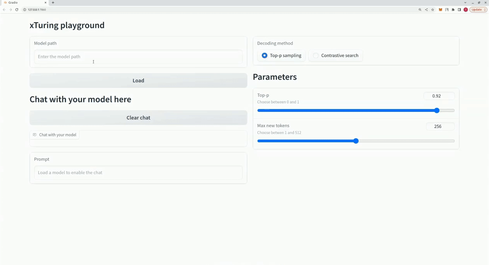

<p align="center">
  
  
</p>
<h3 align="center">Build, customize and control your own personal LLMs</h3>

<p align="center">
  <a href="https://pypi.org/project/xturing/">
    
  </a>
  <a href="https://xturing.stochastic.ai/">
    
  </a>
  <a href="https://discord.gg/TgHXuSJEk6">
    
  </a>
</p>
<br>

___

`xturing` provides fast, efficient and simple fine-tuning of LLMs, such as LLaMA, GPT-J, Galactica, and more.
By providing an easy-to-use interface for fine-tuning LLMs to your own data and application, xTuring makes it
simple to build, customize and control LLMs. The entire process can be done inside your computer or in your
private cloud, ensuring data privacy and security.

With `xturing` you can,
- Ingest data from different sources and preprocess them to a format LLMs can understand
- Scale from single to multiple GPUs for faster fine-tuning
- Leverage memory-efficient methods (i.e. INT4, LoRA fine-tuning) to reduce hardware costs by up to 90%
- Explore different fine-tuning methods and benchmark them to find the best performing model
- Evaluate fine-tuned models on well-defined metrics for in-depth analysis

<br>

## 🌟 INT4 fine-tuning with LLaMA LoRA

We are excited to announce the latest enhancement to our `xTuring` library: INT4 fine-tuning demo. With this update, you can fine-tune LLMs like LLaMA with LoRA architecture in INT4 precision with less than `6 GB` of VRAM. This breakthrough significantly reduces memory requirements and accelerates the fine-tuning process, allowing you to achieve state-of-the-art performance with less computational resources.

More information about INT4 fine-tuning and benchmarks can be found in the [INT4 README](examples/int4_finetuning/README.md).

You can check out the [LLaMA INT4 fine-tuning example](examples/int4_finetuning/LLaMA_lora_int4.ipynb) to see how it works.

<br>

## CLI playground


## UI playground


<br>

## ⚙️ Installation
```bash
pip install xturing
```

<br>

## 🚀 Quickstart
```python
from xturing.datasets import InstructionDataset
from xturing.models import BaseModel

# Load the dataset
instruction_dataset = InstructionDataset("./alpaca_data")

# Initialize the model
model = BaseModel.create("llama_lora")

# Finetune the model
model.finetune(dataset=instruction_dataset)

# Perform inference
output = model.generate(texts=["Why LLM models are becoming so important?"])

print("Generated output by the model: {}".format(output))
```

You can find the data folder [here](examples/llama/alpaca_data).

<br>

## 📚 Tutorials
- [Preparing your dataset](examples/llama/preparing_your_dataset.py)
- [Cerebras-GPT fine-tuning with LoRA and INT8](examples/cerebras/cerebras_lora_int8.ipynb) &ensp; [](https://colab.research.google.com/drive/1eKq3oF7dnK8KuIfsTE70Gvvniwr1O9D0?usp=sharing)
- [Cerebras-GPT fine-tuning with LoRA](examples/cerebras/cerebras_lora.ipynb) &ensp; [](https://colab.research.google.com/drive/1VjqQhstm5pT4EjPjx4Je7b3W2X1V3vDo?usp=sharing)
- [LLaMA fine-tuning with LoRA and INT8](examples/llama/llama_lora_int8.py) &ensp; [](https://colab.research.google.com/drive/1SQUXq1AMZPSLD4mk3A3swUIc6Y2dclme?usp=sharing)
- [LLaMA fine-tuning with LoRA](examples/llama/llama_lora.py)
- [LLaMA fine-tuning](examples/llama/llama.py)
- [GPT-J fine-tuning with LoRA and INT8](examples/gptj/gptj_lora_int8.py) &ensp; [](https://colab.research.google.com/drive/1hB_8s1V9K4IzifmlmN2AovGEJzTB1c7e?usp=sharing)
- [GPT-J fine-tuning with LoRA](examples/gptj/gptj_lora.py)
- [GPT-2 fine-tuning with LoRA](examples/gpt2/gpt2_lora.py) &ensp; [](https://drive.google.com/file/d/1Sh-ocNpKn9pS7jv6oBb_Q8DitFyj1avL/view?usp=sharing)

<br>

## 📊 Performance

Here is a comparison for the performance of different fine-tuning techniques on the LLaMA 7B model. We use the [Alpaca dataset](examples/llama/alpaca_data/) for fine-tuning. The dataset contains 52K instructions.

Hardware:

4xA100 40GB GPU, 335GB CPU RAM

Fine-tuning parameters:

```javascript
{
  'maximum sequence length': 512,
  'batch size': 1,
}
```

|      LLaMA 7B      | DeepSpeed + CPU Offloading | LoRA + DeepSpeed  | LoRA + DeepSpeed + CPU Offloading |
| --------- | ---- | ---- | ---- |
| GPU | 33.5 GB | 23.7 GB | 21.9 GB |
| CPU | 190 GB  | 10.2 GB | 14.9 GB |
| Time per epoch | 21 hours  | 20 mins | 20 mins |

Contribute to this by submitting your performance results on other GPUs by creating an issue with your hardware specifications, memory consumption and time per epoch.

<br>

## 📎 Fine-tuned model checkpoints
We have already fine-tuned some models that you can use as your base or start playing with.
Here is how you would load them:

```python
from xturing.models import BaseModel
model = BaseModel.load("x/distilgpt2_lora_finetuned_alpaca")
```

| model               | dataset | Path          |
|---------------------|--------|---------------|
| DistilGPT-2 LoRA | alpaca | `x/distilgpt2_lora_finetuned_alpaca` |
| LLaMA LoRA          | alpaca | `x/llama_lora_finetuned_alpaca` |

<br>

## 📈 Roadmap
- [x] Support for LLaMA, GPT-J, GPT-2, OPT, Cerebras-GPT, Galactica and Bloom models
- [x] Dataset generation using self-instruction
- [x] Low-precision LoRA fine-tuning and unsupervised fine-tuning
- [x] INT8 low-precision fine-tuning support
- [x] OpenAI, Cohere and AI21 Studio model APIs for dataset generation
- [x] Added fine-tuned checkpoints for some models to the hub
- [x] INT4 LLaMA LoRA fine-tuning demo
- [ ] Evaluation of LLM models
- [ ] Support for Stable Diffusion

<br>

## 🤝 Help and Support
If you have any questions, you can create an issue on this repository.

You can also join our [Discord server](https://discord.gg/TgHXuSJEk6) and start a discussion in the `#xturing` channel.

<br>

## 📝 License
This project is licensed under the Apache License 2.0 - see the [LICENSE](LICENSE) file for details.

<br>

## 🌎 Contributing
As an open source project in a rapidly evolving field, we welcome contributions of all kinds, including new features and better documentation. Please read our [contributing guide](CONTRIBUTING.md) to learn how you can get involved.
